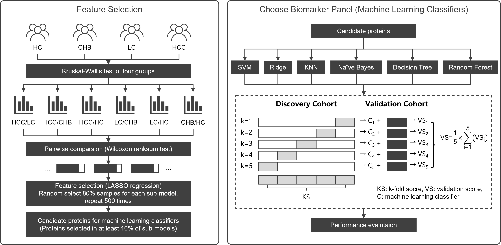

# Serum Study of Liver Diseases

 Link to repository: [github.com/PHOENIXcenter/SerumStudyOfLiverDiseases](https://github.com/PHOENIXcenter/SerumStudyOfLiverDiseases)
+ Summary of scripts used for feature selection and machine learning in the project
+ MS-based proteome data are from two independent cohort:

|    **Cohort**     | **HC (Healthy Control)** | **CHB (Chronic Hepatitis B)** | **LC (Liver Cirrhosis)** | **HCC (Hepatocellular Carcinoma)** |
| :---------------- | :----------------------- | :--------------------------------- | :----------------------- | :--------------------------------- |
| Discovery cohort (n=125) | 21 | 29 | 29 | 46 |
| Validation cohort (n=75) | 15 | 15 | 15 | 30 |

## Contents

| Script                                        | Description                                                  |
| :-------------------------------------------- | :----------------------------------------------------------- |
| [Feature_Importance.py](Feature_Importance.py)   | Contains feature selection part. we used the LASSO model to executing feature selection, randomly select 80% of the samples each time to build a total of 500 sub-models, and chose proteins selected in at least 10% of the sub-models as candidate protein features. |
| [Classifier_Model.py](Classifier_Model.py)       | Contains machine learning modeling and performance evaluation part. We separately evaluated the performance of 6 classical machine learning models (SVM, Ridge, KNN, Naïve Bayes, Decision Tree and Random Forest) in each pairwise comparisons using corresponding candidate markers in both 5-fold discovery cohort and independent validation cohort. The main evaluation index are F1-score and AUROC. |
| [Model_Visualization.py](Model_Visualization.py) | Contains visualization of machine learning models, including confusion matrix and ROC curve of both 5-fold discovery cohort and validation cohort. |

## Statement

The complete serum proteomics data and clinical data are available from the authors upon reasonable request due to the need to maintain patient confidentiality.

## Workflow of machine learning modeling

